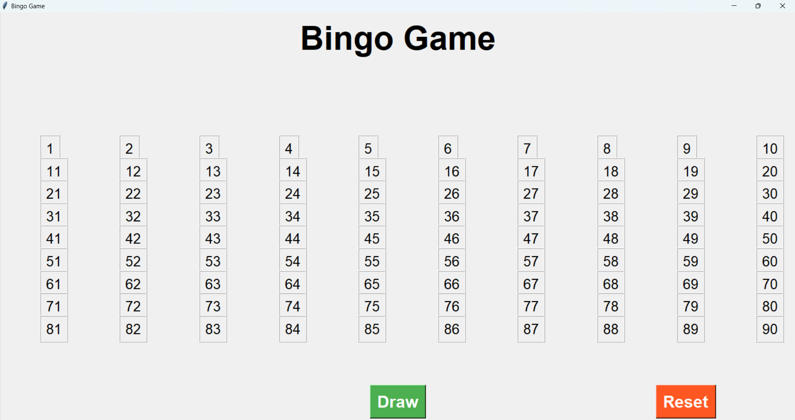

# Bingo Game 🎲

- My family loves board games.
- We used to have one of those home bingo games with a manual wheel and the number balls, though after some years most balls were lost but the hype for some family bingo nights was not!
- So I decided to create this very simple number drawer, because why not?

### 📸 Screenshot

### ⚒ Requirements

- Python 3.6 or above

### 🚀 Installation

- Clone the repo:
"git clone https://github.com/gpinho7/bingo-dashboard.git"

- Execute the script:
"python bingo.py"

### 🎮 How to play

- Press the green button "Draw" to draw a random number.

- The last 5 drawn number are highlighted on top

- Already drawn numbers will be set to green on the main grid.

- Press the red "Reset" button to restart the game.

### ✨ Future Work 

- Not sure to be honest. I just wanted to create an easy bingo drawer for the game nights with my family, might make it better somehow.
- Maybe create an .exe to make it easier to run

### 🤝 THANKS!
